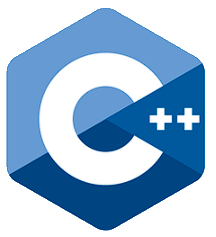
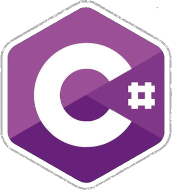
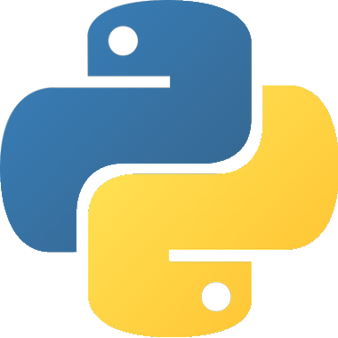
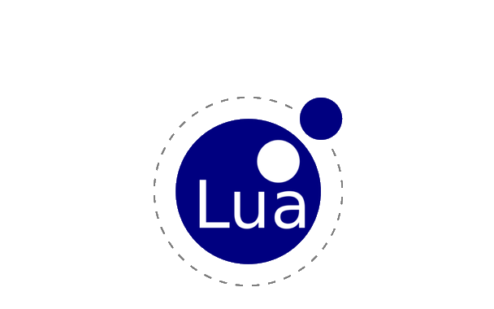

<h1 align="center">
    Program
</h1>

## Hello and welcome to my profil !

    <i>You can found my <a href="">website</a> !</i>

## Content

In my profil you can found my projects and more, who are (where I am most active):
    <ul>
        <li><a href="https://github.com/Program132/PRC">PRC</a>, a programming langage !</li>
        <li><a href="https://github.com/Program132/ArkScript">My code in ArkScript</a>, a programming langage by <a href="https://github.com/SuperFola">SuperFola</a> !</li>
        <li><a href="https://github.com/Program132/C">C++ & C#</a>, my code in C++ and in C#.</li>
    </ul>

## My langages I'm using.

    &nbsp;&nbsp;
    &nbsp;&nbsp;
    &nbsp;&nbsp;
    &nbsp;&nbsp;
    

## My links

- [Discord : Program Entertainment](https://discord.gg/dkkPWZmS92 "Program Entertainment | Server Discord")
- [Youtube : Program Entertainment](https://www.youtube.com/channel/UCIp6bK6Jmtdk4IL-CZPVWgw "Program Entertainment | Youtube")
- [Twitter : Program Entertainment](https://twitter.com/ScriptingbeyRBX "Program Entertainment | Twitter")
- [Website : Program / Program132](https://program132.github.io/ "Program | Website")