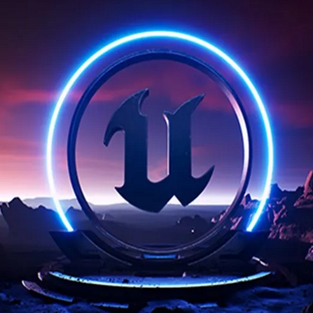

<h1 align="center">
    Program 
    
</h1>

## Hello and welcome to my profil !

    <i>You can found my <a href="https://program132.github.io/home.html">website</a> !</i>

## Content

In my profil you can found my projects and more, who are (where I am most active):
    <ul>
        <li><a href="https://github.com/French-Programming-Language">French Programming Language (F.P.L)</a>, a programming language which use french expressions</li>
        <li><a href="https://github.com/Program132/P-IDE">P-IDE (Program IDE)</a>, my own IDE for my projects (it includes: C++, Lua, Java, TypeScript, F.P.L, Python, ArkScript)</li>
        <li><a href="https://github.com/Pruglins">Pruglins (Program Plugins)</a>, plugins I created for Minecraft</li>
    </ul>

## Langages/framework/libs I'm using.

    &nbsp;&nbsp;
    &nbsp;&nbsp;
    &nbsp;&nbsp;
    &nbsp;&nbsp;
    
    
    
    
    
    

## My links

- [Program Entertainment Discord](https://discord.gg/gVt5eUQbvp)
- [Personal Twitter](https://twitter.com/Program_Off)
- [Studio Twitter](https://twitter.com/ProgramE_Off)
- [Website](https://program132.github.io/home.html")
